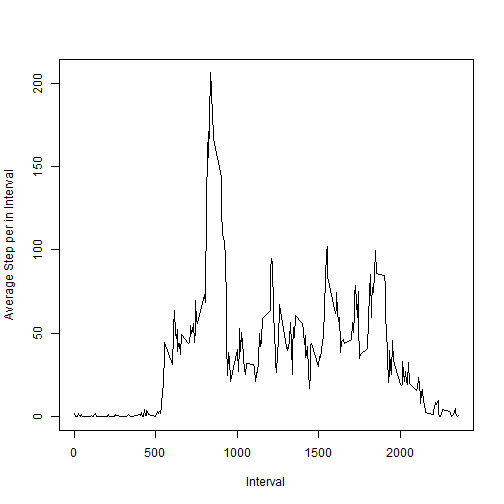

## Loading and preprocessing the data


```r
library('gridExtra')
```

```
## Warning: package 'gridExtra' was built under R version 3.2.2
```

```r
library('ggplot2')
data <- read.csv('activity.csv',na.strings = 'NA')
data$date <- as.Date(data$date)
# data <- data[!is.na(data$steps),]
head(data)
```

```
##   steps       date interval
## 1    NA 2012-10-01        0
## 2    NA 2012-10-01        5
## 3    NA 2012-10-01       10
## 4    NA 2012-10-01       15
## 5    NA 2012-10-01       20
## 6    NA 2012-10-01       25
```


## What is mean total number of steps taken per day?

```r
perDayStep <- tapply(data$steps, INDEX = data$date, sum)
hist(perDayStep, breaks = 10, ylab = 'Number of Steps', xlab = 'day')
```

 

```r
meanValue <- mean(perDayStep, na.rm = TRUE)
medianValue <- median(perDayStep,na.rm = TRUE)
print(sprintf('Mean Value: %.2f', meanValue))
```

```
## [1] "Mean Value: 10766.19"
```

```r
print(sprintf('Median Value: %.2f',medianValue))
```

```
## [1] "Median Value: 10765.00"
```


## What is the average daily activity pattern?


```r
avgSteps <- tapply(data$steps, INDEX = data$interval,function (x) mean(x, na.rm = TRUE))
plot(names(avgSteps), avgSteps,type = 'l', ylab = 'Average Step per in Interval', xlab = 'Interval')
```

 

```r
maxStepID <- which.max(avgSteps)
maxInterval <- names(avgSteps)[maxStepID]
print(sprintf('Interval with Maximum Step Average is: %s', maxInterval))
```

```
## [1] "Interval with Maximum Step Average is: 835"
```

## Imputing missing values

```r
completeCount <- sum(complete.cases(data))
rowsWithNA <- dim(data)[1] - completeCount
print(sprintf('Number of Rows with NA: %d', rowsWithNA))
```

```
## [1] "Number of Rows with NA: 2304"
```
Fill in NAs with mean value

```r
filledData <- data
NAsIntervals <- filledData$interval[is.na(filledData$steps)]
filledData$steps[is.na(filledData$steps)] <- avgSteps[which(NAsIntervals == names(avgSteps))]
perDayStep <- tapply(filledData$steps, INDEX = filledData$date, sum)
hist(perDayStep, breaks = 10, ylab = 'Number of Steps', xlab = 'day', main = 'After Imputing NAs')
```

 
We See Imputing Data has not changed the histogram. because each NA value has been   
replaced by it's interval mean.

```r
meanValue <- mean(perDayStep, na.rm = TRUE)
medianValue <- median(perDayStep,na.rm = TRUE)
print(sprintf('Mean Value: %.2f', meanValue))
```

```
## [1] "Mean Value: 10766.19"
```

```r
print(sprintf('Median Value: %.2f',medianValue))
```

```
## [1] "Median Value: 10765.59"
```


## Are there differences in activity patterns between weekdays and weekends?


```r
perDayStepWeekDay <- tapply(filledData$steps, INDEX = filledData$date, mean)
df <- data.frame(avg = perDayStep , date = as.Date(names(perDayStepWeekDay)),weekday = weekdays(as.Date(names(perDayStepWeekDay))))
df$weekend <- df$weekday %in% c('Friday')

dfEnd= df[df$weekend,]
cs <- complete.cases(dfEnd)
dfEnd <- dfEnd[cs,]
dfDay= df[!df$weekend,]
cs <- complete.cases(dfDay)
dfDay <- dfDay[cs,]
p1 <- qplot(dfEnd$date, dfEnd$avg, main = 'Weekend',xlab = 'date', ylab = 'step avg') + geom_line()
p2<- qplot(dfDay$date, dfDay$avg,main = 'Weekday',xlab = 'date', ylab = 'step avg') + geom_line()
 grid.arrange(p1,p2,nrow = 2)
```

 
